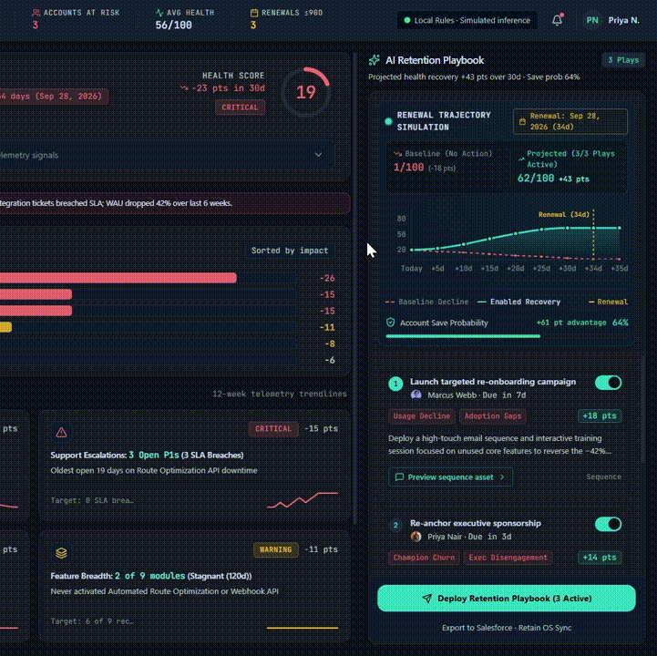

# Retain OS

A churn-risk command center for B2B SaaS Customer Success. It scores account
health from weighted telemetry signals, shows exactly which signals cost how
many points, and models how much health each retention play would recover
before anyone commits to running it.

**[Live demo →](https://retain-os-seven.vercel.app/)**



---

## What this is, plainly

The account data is **synthetic**, six fictional companies defined in
`src/data/accounts.ts`, with no CRM, product-analytics, or support system behind
them.

The scoring and the playbook logic are **real**. Every figure on screen is
derived at runtime from a weighted model and a rule engine you can read in a few
hundred lines. Nothing displayed is hardcoded, and despite the panel being
labelled "AI Retention Playbook", there is no language model and no network call
anywhere in the project.

That last point is deliberate rather than a limitation. A retention
recommendation that a CS lead cannot audit is a recommendation they will not
act on. Making the engine deterministic means every play traces back to a
specific signal and a specific arithmetic operation, and as a side effect, the
demo loads instantly, works offline, and costs nothing to host.

## The problem

Customer Success teams usually learn that an enterprise account is leaving when
the cancellation notice arrives. By then the renewal conversation is a
negotiation about exit terms.

The signals almost always existed months earlier and were sitting in separate
systems: weekly active users declining in the product analytics tool, P1 tickets
breaching SLA in the support queue, the executive champion updating their
LinkedIn, seat utilisation drifting below what the contract was sized for. No
single system owns the composite picture, so nobody sees the shape of it until
it is too late to change the outcome.

The hard part is not detection. It is turning a health score into something a
CSM can act on this week, with a defensible answer to "why this account, and why
this intervention".

## How a health score is produced

Health is `100 − Σ(signal penalties)`, clamped to 0–100. Six signals, each with
a fixed maximum weight, each producing a penalty from its own measured value.
No model, no learned weights, no black box.

| Signal | Max weight | What it measures |
|---|---|---|
| Usage decline (WAU) | 30 | Weekly active users against the account's expected baseline |
| Support escalations | 20 | Open P1 count, SLA breaches, ticket velocity |
| Champion churn | 15 | Whether the economic buyer or champion is still in role |
| Adoption & feature breadth | 15 | Modules activated against modules contracted |
| Executive disengagement | 10 | Days since the last QBR or executive touchpoint |
| Commercial utilisation risk | 10 | Seat utilisation and downgrade signals |

Take **Nexus Logistics** - $210,000 ARR, renewing in 34 days:

```
base score                        100

usage decline (WAU)               −26    312 → 181 WAU over 6 weeks (−42%)
support escalations               −15    3 open P1s, oldest 19 days, 3 SLA breaches
champion churn                    −15    VP of Ops departed without handover
adoption & feature breadth        −11    core modules unactivated
executive disengagement            −8    no QBR inside the window
commercial utilisation risk        −6    seat utilisation below contract
                                 ─────
total penalties                   −81

health score                       19    CRITICAL
```

The app displays `19`, and the risk waterfall shows those six contributions as
proportional bars. "Explain this score" in the UI expands the same breakdown.
You can add the bars up by hand and get the number in the gauge.

**Acme Corp** runs through the identical model and lands at 34: penalties of
−22, −18, −12, −8, −6, and **0** for champion churn, because its CTO is still in
role. The same signal contributes nothing when the account is healthy on that
dimension, the weights are ceilings, not fixed deductions.

## The plays

Each signal that breaches its threshold maps to one intervention. Plays carry an
owner, a due date, an impact in health points, and the evidence chips naming
which signals triggered them.

| Trigger | Play | Asset produced |
|---|---|---|
| Champion departed or changed role | Re-anchor executive sponsorship | Email template + stakeholder map |
| WAU decline past threshold | Launch targeted re-onboarding campaign | Multi-touch sequence |
| Two or more open P1s | Escalate and close P1 backlog | Escalation brief + engineering sync agenda |
| No QBR inside the window | Run value realization QBR | ROI deck outline |
| Seat utilisation below contract | Commercial re-scoping conversation | Renewal options one-pager |

The top three plays by impact are surfaced. Accounts receive different plays
because they have different signals: Nexus gets an executive re-anchor play
because its champion left; Acme does not, and gets a QBR play instead because
its last executive touchpoint was 95 days ago.

## The projection

This is the part worth looking at. Each play carries an impact value, and the
30-day trajectory chart plots two series: a baseline decline if nothing is done,
and a recovery curve from the plays currently enabled.

Toggling a play recalculates everything downstream immediately.

For Nexus, with all three plays active:

```
current health                     19
enabled play impacts              +43
                                 ─────
projected health                   62      at renewal, 34 days out

baseline decline                  −18      derived from usage-decline severity
baseline health                     1
advantage                         +61
```

Switch off the +18 re-onboarding play and the projection recomputes to `44/100`
at `+25`, the baseline is unchanged at `1`, and the advantage falls to `+43`.
Both the panel subheader and the trajectory box read from a single function, so
they cannot disagree - an earlier version computed them separately and drifted,
which is exactly the class of bug that destroys trust in a dashboard.

The baseline decline is derived per account rather than fixed: Nexus declines 18
points against Acme's 13, because Nexus's usage signal is more severe.

## Assumptions and limitations

Stating these plainly, because the model does not capture everything a real
retention system would:

- **The weights are a designed model, not a fitted one.** They encode a
  defensible view of what predicts B2B SaaS churn, usage decline first,
  champion loss heavily weighted - but they are not regressed against outcome
  data. A production version would learn them from historical renewals.
- **Play impact values are estimates.** `+18` for a re-onboarding campaign is a
  reasoned figure, not a measured one. In production these would come from
  measured lift on similar accounts, with confidence intervals rather than point
  values.
- **Signals are treated as independent.** They are not. Champion loss frequently
  causes the usage decline it is scored separately from, so the model
  double-counts a single underlying event. A causal model would discount the
  correlated portion.
- **Recovery is modelled as additive.** Running three plays does not deliver the
  sum of their individual effects, they compete for the same customer attention
  and the same limited hours. Diminishing returns are not modelled.
- **The renewal date is not weighted into urgency.** An account 22 days from
  renewal is materially harder to save than one 140 days out, and the scoring
  does not currently reflect that.
- **Six accounts, one shape of business.** Enterprise, annual, high-ARR. The
  model would need rethinking for self-serve or usage-based pricing.

## How I'd build this for production

The console is the straightforward part. A real implementation would need:

**Ingestion.** Product analytics for WAU and feature adoption, the support
system for ticket state and SLA breaches, CRM for contract and seat data, and
calendar or email metadata for executive engagement recency. Champion departure
is the awkward one, CRM contact status lags reality by months, so it usually
comes from an enrichment provider or from bounce signals on outbound email.

**Weights as versioned configuration.** The weighting model moves out of code
into a reviewable config, so a RevOps lead can adjust it without a deploy and so
changes are auditable when a score moves.

**Calibration against outcomes.** The score is only worth anything if accounts
scoring below 30 actually churn more often than accounts scoring above 70. That
requires holding predictions against realised renewals and reporting the
model's accuracy openly, including when it is wrong.

**Play impact from measured lift.** Instead of static point values, track which
plays ran on which accounts and what happened, then attribute recovery to
interventions. This is the part that turns the projection from a plausible
illustration into a real forecast.

**Workflow integration.** Deploy should create real tasks in the CRM, real
sequences in the marketing automation tool, and real calendar holds. A playbook
that has to be re-entered by hand somewhere else will not get used.

**Feedback on dismissals.** Track which plays CSMs turn off and why. A play with
a high dismissal rate is a badly-calibrated rule, and that signal is more useful
than adding more plays.

## Running locally

```bash
git clone https://github.com/prakhar895/retain-os.git
cd retain-os
npm install
npm run dev
```

No API keys, no environment variables, no backend, no external services. The
app makes zero network requests at runtime.

## Structure

```
src/
├── data/
│   └── accounts.ts        Six synthetic accounts with signals and history
├── lib/
│   ├── scoring.ts         Health calculation and risk contribution breakdown
│   ├── playbookEngine.ts  Rule table, play generation, projection math
│   └── simulateStream.ts  Streaming-text helper for the generation sequence
├── components/            Presentational React components
└── App.tsx                State, derivations, wiring
```

`scoring.ts` and `playbookEngine.ts` have no React dependency and no knowledge
of the UI.

## Stack

React, TypeScript, Vite, Tailwind, Recharts. UI scaffolded with Google Stitch
and built in Google AI Studio, then iterated on directly - including a round of
fixes to reconcile two projection calculations that had diverged, and to make
the baseline decline account-specific rather than constant.
